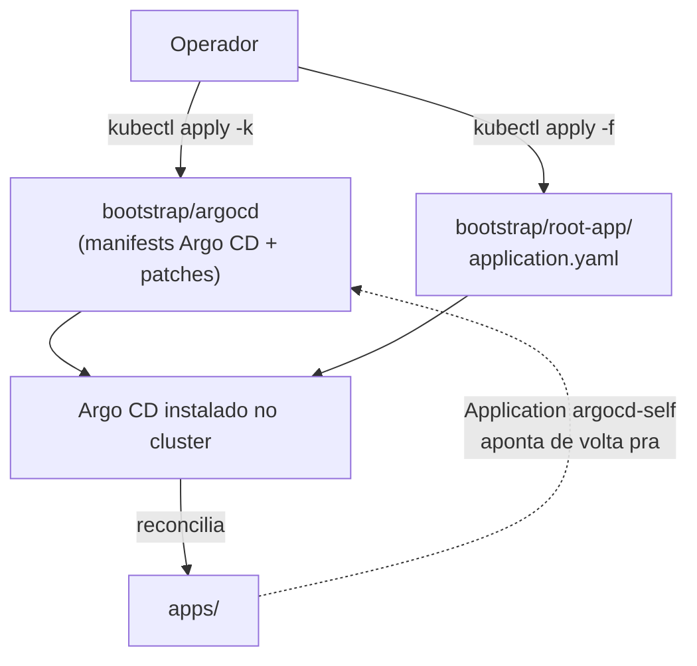
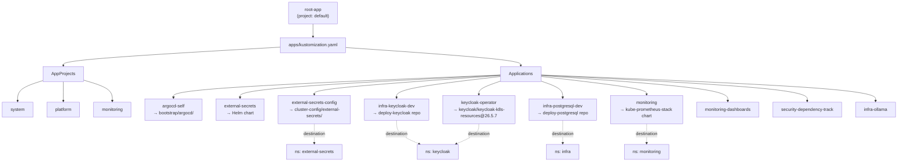
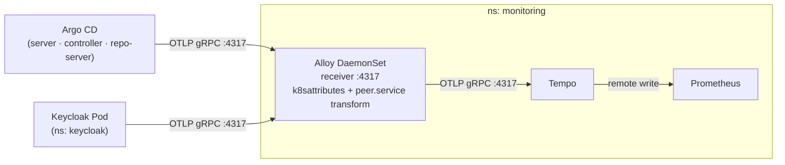
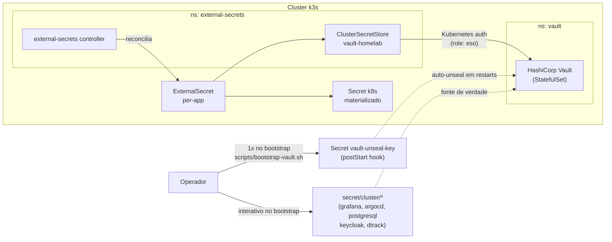

# Architecture — deploy-argocd

## Overview

Repo GitOps **âncora** do homelab. Hospeda o bootstrap do Argo CD e o
"root app" que materializa todos os outros workloads do cluster
(Postgres, Keycloak, monitoring, External Secrets) por reconciliação
contínua a partir do Git.

Modelo escolhido: **App-of-Apps** clássico — root-app aponta pra um
diretório (`apps/`) que enumera AppProjects/Applications, cada uma
sincronizando manifests deste repo (`envs/`, `cluster-config/`) ou de
repos satélite (`deploy-postgresql`, `deploy-keycloak`, charts oficiais).

Após bootstrap inicial, o Argo CD passa a se auto-gerenciar (Application
`argocd-self`) e qualquer mudança em `bootstrap/argocd/` chega ao
cluster via PR.

Para "o que existe" e "como rodar", ver [README.md](README.md).

---

## Bootstrap e auto-reconciliação

Bootstrap manual roda **uma vez**. Depois disso `bootstrap/argocd/` é
reconciliado pela Application `argocd-self` — mudanças em patches,
versão upstream do Argo CD, ou config do controller chegam ao cluster
por PR no Git, não por `kubectl`.

O único segredo que **não** mora no Git é o `vault-unseal-key` (criado
por `scripts/bootstrap-vault.sh` no primeiro boot). Após isso, o Vault
auto-unsela em restarts via postStart hook e todo o restante é GitOps puro.

---

## App-of-Apps

`apps/kustomization.yaml` é o ponto único de adicionar/remover
Applications. AppProjects restringem `sourceRepos` e `destinations`
(escopo por projeto), e cada Application aponta pra:
- repo deste mesmo (`bootstrap/argocd`, `cluster-config/`, `envs/`),
- repo satélite GitOps (`deploy-postgresql`, `deploy-keycloak`),
- ou Helm chart upstream (`external-secrets`, `kube-prometheus-stack`).

---

## Observabilidade — pipeline de traces

Todos os serviços instrumentados enviam traces para o **Alloy** (não diretamente
para o Tempo). O Alloy aplica dois processadores antes de encaminhar:

1. **`k8sattributes`** — enriquece spans com metadados do pod de origem
   (`k8s.pod.name`, `k8s.deployment.name`, `k8s.namespace.name`) usando o IP de
   conexão para lookup na k8s API.
2. **`transform` (OTTL)** — deriva o atributo `peer.service` a partir de
   `server.address`:
   - FQDN (`postgresql.infra.svc.cluster.local`) → primeiro componente (`postgresql`)
   - Short hostname (`keycloak-service`) → usado diretamente

Isso habilita a view **Service Structure** no Grafana Drilldown
(`grafana-exploretraces-app`), que usa a query:
`{span.kind="client"} | rate() by (resource.service.name, span.peer.service)`.

ArgoCD é configurado via `argocd-cmd-params-cm-patch.yaml`
(`otlp.address: monitoring-alloy.monitoring.svc.cluster.local:4317`).
Keycloak via `additionalOptions[tracing-endpoint]` no `Keycloak` CR
(gerenciado em `deploy-keycloak`).

---

## External Secrets — HashiCorp Vault

O único artefato fora do Git é o `vault-unseal-key` — necessário para o
postStart hook auto-unselar o Vault em reinicializações do pod. Os secrets
de aplicação (`secret/cluster/*`) também vivem só no Vault; o
`bootstrap-vault.sh` os coleta interativamente no primeiro boot e os
escreve diretamente via `vault kv put`.

---

## Decisões de design

### App-of-Apps com root-app sincronizando diretório

**Escolha:** root-app aponta pra `apps/`; cada Application/Project é
arquivo separado em `apps/applications/` ou `apps/projects/`.

**Alternativa:** ApplicationSet com generator git/cluster fazendo
fan-out automático.

**Por quê:** ApplicationSet generators (matrix, git directories,
clusters) renderizam Applications em runtime — não-lintáveis
estaticamente. Pipeline de lint do `org-ci-platform` opera sobre output
do `kustomize build` e não tem como expandir generator sem cluster
real. App-of-Apps mantém manifests Argo CD versionados em texto.

**Custo:** adicionar app nova exige novo arquivo + entrada em
`apps/kustomization.yaml`. ApplicationSet faria isso por convenção de
diretório. `apps/applicationsets/infra.yaml` existe como hook futuro
(disabled hoje com `CHANGE_ME_REPO_URL`).

### Argo CD self-managed via `argocd-self`

**Escolha:** após bootstrap manual, Application `argocd-self` aponta
pra `bootstrap/argocd/` deste repo. Mudanças em versão, patches, ou
config caem por PR.

**Alternativa:** Argo CD instalado e atualizado por `kubectl apply`
out-of-band em cada upgrade.

**Por quê:** PR review no upgrade do controller que orquestra todo o
resto do cluster. Mudança no `argocd-cmd-params-cm-patch.yaml` ou bump
de versão upstream passa pelo lint pipeline antes de chegar ao cluster.

**Custo:** cuidado extra em upgrade — Argo CD reconciliando mudança em
seus próprios manifests pode reiniciar o controller no meio do sync.
Mitigação: `selfHeal: true` + manifests pinados por SHA do release
upstream (`argo-cd/v2.11.7/manifests/install.yaml`).

### External Secrets + HashiCorp Vault

**Escolha:** ESO + ClusterSecretStore apontando para HashiCorp Vault
self-hosted (no próprio cluster). Vault é a fonte de verdade; o cluster
materializa Secrets k8s sob demanda via Kubernetes auth.

**Alternativa:** SealedSecrets (criptografar e commitar no Git) ou SOPS
(criptografar com KMS/age e commitar).

**Por quê:** Vault self-hosted não depende de SaaS externo, suporta
rotação de secrets sem re-encrypt de arquivos no Git, e o Kubernetes
auth method elimina o chicken-and-egg de tokens estáticos — o ESO
autentica com a própria ServiceAccount do cluster. Em produção, o mesmo
ClusterSecretStore funcionaria sem mudança arquitetural trocando apenas
o `server:` para uma instância externa.

**Custo:** o único bootstrap manual é o `vault-unseal-key` (gerado pelo
`scripts/bootstrap-vault.sh` no primeiro `vault operator init`). Os
secrets de aplicação também precisam ser inseridos uma vez via script.
Após isso, tudo é GitOps puro — novos ExternalSecrets em qualquer repo
satélite funcionam sem intervenção manual.

### Memory limit do `argocd-application-controller`: 1Gi (default era 512Mi)

**Escolha:** `bootstrap/argocd/resources-patch.yaml` bumpa o limit do
container `argocd-application-controller` de 512Mi (default upstream)
pra 1Gi.

**Alternativa:** manter default e dividir a workload pesada em
recursos menores.

**Por quê:** o `KeycloakRealmImport` CR vive inline em
`deploy-keycloak/base/realms/kubernetes/realm-import.yaml` (~2k linhas
de YAML, ~60KB). O Application controller mantém em memória o desired
state de todos os recursos sincronizados pra fazer diff contínuo
contra o cluster — esse CR sozinho consome ~200-300MB durante
reconcile, e com outros workloads grandes (Postgres StatefulSet,
Keycloak Operator manifests) o controller hit OOMKilled em 512Mi.

**Custo:** k3s single-node em WSL homelab tem memória limitada (~8-12GB
total). 1Gi pro controller = 12% do orçamento. Em cluster maior é
inexpressivo; aqui é trade real. Reverter exigiria split do
KeycloakRealmImport em fragmentos menores (1 client por arquivo
talvez) — refactor disruptivo no `deploy-keycloak`.

### Manifests upstream + Kustomize patches em vez de Helm chart

**Escolha:** `bootstrap/argocd/kustomization.yaml` referencia
`install.yaml` upstream do Argo CD por URL pinada (release tag) e
aplica patches strategic-merge.

**Alternativa:** Helm chart oficial argo-cd (`argoproj/argo-cd`).

**Por quê:** patch surface menor — só edito o que importa
(`resources-patch.yaml`, `argocd-cmd-params-cm-patch.yaml`,
`polaris-rbac-exempt-patch.yaml`). Helm chart traz N values que mudam
de versão pra versão; patches strategic-merge falham loud em upgrade
quando o resource alvo muda de nome/path, forçando revisão consciente.

**Custo:** upgrade de major do Argo CD pode quebrar patches (resource
removido, label key renomeada). Trade: catch tarde mas explícito vs.
Helm que silenciosamente troca defaults.

---

## Limitações conhecidas

### Hoje, dentro do escopo atual

- **Bootstrap não-GitOps do `vault-unseal-key`.** O Secret
  `vault-unseal-key` precisa ser criado via `scripts/bootstrap-vault.sh`
  antes do postStart hook funcionar. Recriar o cluster exige rerodar o
  script — não é puro `kubectl apply -k bootstrap/`. Os secrets de
  aplicação (`secret/cluster/*`) também precisam ser re-inseridos
  interativamente no Vault após um cluster wipe.
- **ApplicationSet em `apps/applicationsets/infra.yaml` desabilitado.**
  `repoURL: CHANGE_ME_REPO_URL` é placeholder. Generator git/directories
  está pronto pra ativar (`envs/dev/infra/*` → 1 Application por dir),
  mas hoje cada Application infra é arquivo manual.
- **Sem Image Updater integrado.** Bump de tag de image em apps satélite
  (Postgres, Keycloak) requer PR manual no repo correspondente. Argo CD
  Image Updater integraria com Renovate/Dependabot mas não está
  configurado.
- **Keycloak Operator pinado em 26.5.7.** Versão 26.6.x tem regressão
  upstream com schema/SDK mismatch ([keycloak/keycloak#48438](https://github.com/keycloak/keycloak/issues/48438)).
  Application `keycloak-operator` (project `system`) referencia
  `targetRevision: 26.5.7`. Reverter pro último estável quando bug for
  corrigido — detalhes do impacto em `deploy-keycloak/ARCHITECTURE.md`.

### Se a stack mudar, viram limitação

- **Single cluster (`https://kubernetes.default.svc`).** Multi-cluster
  exigiria cluster secrets registrados no Argo CD + AppProjects com
  `destinations` por cluster. Hoje só há 1 destino.
- **Lint estático não cobre ApplicationSet.** Quando ativar
  `applicationsets/infra.yaml`, manifests gerados em runtime ficam fora
  do `lint-k8s.yml`. Mitigação seria `argocd app diff` em CI com
  cluster ephemeral, fora do escopo atual.
- **Patches strategic-merge sobre install.yaml upstream.** Migração pra
  Helm chart oficial argo-cd mudaria a unidade de configuração de
  patches pra `values.yaml` — refactor de
  `bootstrap/argocd/kustomization.yaml` inteira.
