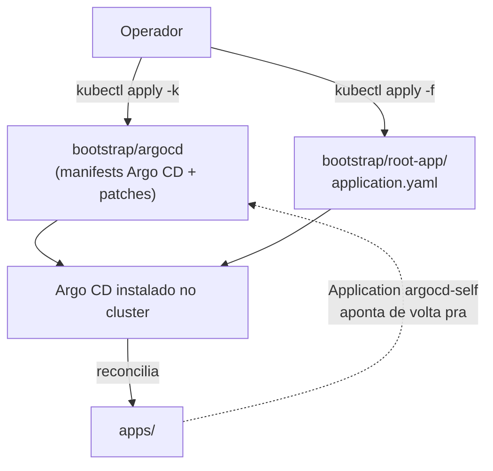
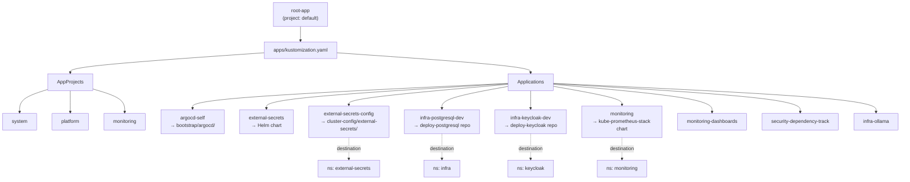
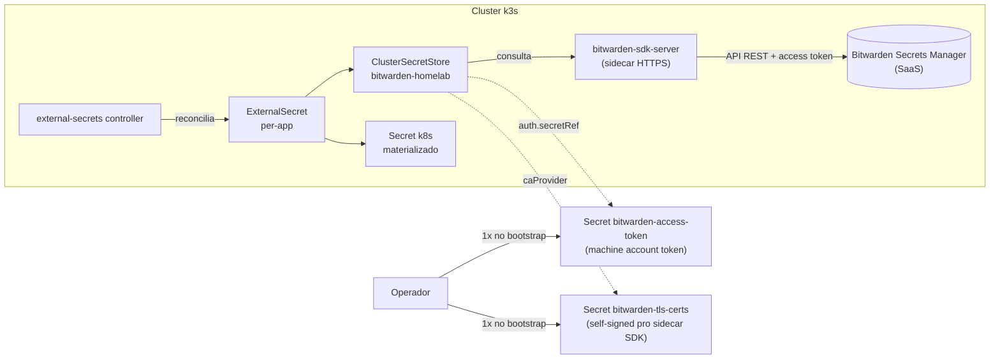

# Architecture — deploy-argocd

## Overview

Repo GitOps **âncora** do homelab. Hospeda o bootstrap do Argo CD e o
"root app" que materializa todos os outros workloads do cluster
(Postgres, Keycloak, monitoring, External Secrets) por reconciliação
contínua a partir do Git.

Modelo escolhido: **App-of-Apps** clássico — root-app aponta pra um
diretório (`apps/`) que enumera AppProjects/Applications, cada uma
sincronizando manifests deste repo (`envs/`, `cluster-config/`) ou de
repos satélite (`deploy-postgresql`, `deploy-keycloak`, charts oficiais).

Após bootstrap inicial, o Argo CD passa a se auto-gerenciar (Application
`argocd-self`) e qualquer mudança em `bootstrap/argocd/` chega ao
cluster via PR.

Para "o que existe" e "como rodar", ver [README.md](README.md).

---

## Bootstrap e auto-reconciliação

Bootstrap manual roda **uma vez**. Depois disso `bootstrap/argocd/` é
reconciliado pela Application `argocd-self` — mudanças em patches,
versão upstream do Argo CD, ou config do controller chegam ao cluster
por PR no Git, não por `kubectl`.

Os 2 segredos sensíveis (`bitwarden-access-token`,
`bitwarden-tls-certs`) **não** moram no Git e precisam ser criados
manualmente antes do ESO virar Ready. `scripts/onboarding.sh` automatiza
o passo-a-passo idempotente.

---

## App-of-Apps

`apps/kustomization.yaml` é o ponto único de adicionar/remover
Applications. AppProjects restringem `sourceRepos` e `destinations`
(escopo por projeto), e cada Application aponta pra:
- repo deste mesmo (`bootstrap/argocd`, `cluster-config/`, `envs/`),
- repo satélite GitOps (`deploy-postgresql`, `deploy-keycloak`),
- ou Helm chart upstream (`external-secrets`, `kube-prometheus-stack`).

---

## External Secrets — Bitwarden Secrets Manager

Os 2 Secrets em laranja-escuro (`bitwarden-access-token`,
`bitwarden-tls-certs`) **não** podem ficar no Git (token vazaria;
cert é gerado por host). São criados pelo `scripts/onboarding.sh` antes
do ClusterSecretStore virar Ready. A partir daí, qualquer
ExternalSecret novo (em outro repo GitOps) é GitOps puro.

---

## Decisões de design

### App-of-Apps com root-app sincronizando diretório

**Escolha:** root-app aponta pra `apps/`; cada Application/Project é
arquivo separado em `apps/applications/` ou `apps/projects/`.

**Alternativa:** ApplicationSet com generator git/cluster fazendo
fan-out automático.

**Por quê:** ApplicationSet generators (matrix, git directories,
clusters) renderizam Applications em runtime — não-lintáveis
estaticamente. Pipeline de lint do `org-ci-platform` opera sobre output
do `kustomize build` e não tem como expandir generator sem cluster
real. App-of-Apps mantém manifests Argo CD versionados em texto.

**Custo:** adicionar app nova exige novo arquivo + entrada em
`apps/kustomization.yaml`. ApplicationSet faria isso por convenção de
diretório. `apps/applicationsets/infra.yaml` existe como hook futuro
(disabled hoje com `CHANGE_ME_REPO_URL`).

### Argo CD self-managed via `argocd-self`

**Escolha:** após bootstrap manual, Application `argocd-self` aponta
pra `bootstrap/argocd/` deste repo. Mudanças em versão, patches, ou
config caem por PR.

**Alternativa:** Argo CD instalado e atualizado por `kubectl apply`
out-of-band em cada upgrade.

**Por quê:** PR review no upgrade do controller que orquestra todo o
resto do cluster. Mudança no `argocd-cmd-params-cm-patch.yaml` ou bump
de versão upstream passa pelo lint pipeline antes de chegar ao cluster.

**Custo:** cuidado extra em upgrade — Argo CD reconciliando mudança em
seus próprios manifests pode reiniciar o controller no meio do sync.
Mitigação: `selfHeal: true` + manifests pinados por SHA do release
upstream (`argo-cd/v2.11.7/manifests/install.yaml`).

### External Secrets + Bitwarden Secrets Manager

**Escolha:** ESO + ClusterSecretStore apontando pra Bitwarden Secrets
Manager (SaaS). Vault externo é a fonte de verdade; cluster materializa
Secrets sob demanda.

**Alternativa:** SealedSecrets (criptografar e commitar no Git) ou SOPS
(criptografar com KMS/age e commitar).

**Por quê:** vault externo não exige chave comitada nem cerimônia de
re-encrypt no key rotation. Bitwarden free tier serve pro escopo
homelab. Em produção, mudaria provider (AWS Secrets Manager,
HashiCorp Vault) sem mudar arquitetura — `provider:` do
ClusterSecretStore.

**Custo:** chicken-and-egg de bootstrap — `bitwarden-access-token` e
TLS cert do sidecar SDK precisam existir antes do ESO funcionar, então
não dá pra serem GitOps. `scripts/onboarding.sh` resolve idempotente.

### Manifests upstream + Kustomize patches em vez de Helm chart

**Escolha:** `bootstrap/argocd/kustomization.yaml` referencia
`install.yaml` upstream do Argo CD por URL pinada (release tag) e
aplica patches strategic-merge.

**Alternativa:** Helm chart oficial argo-cd (`argoproj/argo-cd`).

**Por quê:** patch surface menor — só edito o que importa
(`resources-patch.yaml`, `argocd-cmd-params-cm-patch.yaml`,
`polaris-rbac-exempt-patch.yaml`). Helm chart traz N values que mudam
de versão pra versão; patches strategic-merge falham loud em upgrade
quando o resource alvo muda de nome/path, forçando revisão consciente.

**Custo:** upgrade de major do Argo CD pode quebrar patches (resource
removido, label key renomeada). Trade: catch tarde mas explícito vs.
Helm que silenciosamente troca defaults.

---

## Limitações conhecidas

### Hoje, dentro do escopo atual

- **Bootstrap não-GitOps de 2 segredos.** `bitwarden-access-token` e
  `bitwarden-tls-certs` precisam ser criados via `kubectl` antes do ESO
  virar Ready — caso contrário, ClusterSecretStore não materializa
  outros Secrets. `scripts/onboarding.sh` torna idempotente, mas
  recriar o cluster exige rerodar o script (não é puro `kubectl apply
  -k bootstrap/`).
- **ApplicationSet em `apps/applicationsets/infra.yaml` desabilitado.**
  `repoURL: CHANGE_ME_REPO_URL` é placeholder. Generator git/directories
  está pronto pra ativar (`envs/dev/infra/*` → 1 Application por dir),
  mas hoje cada Application infra é arquivo manual.
- **Sem Image Updater integrado.** Bump de tag de image em apps satélite
  (Postgres, Keycloak) requer PR manual no repo correspondente. Argo CD
  Image Updater integraria com Renovate/Dependabot mas não está
  configurado.

### Se a stack mudar, viram limitação

- **Single cluster (`https://kubernetes.default.svc`).** Multi-cluster
  exigiria cluster secrets registrados no Argo CD + AppProjects com
  `destinations` por cluster. Hoje só há 1 destino.
- **Lint estático não cobre ApplicationSet.** Quando ativar
  `applicationsets/infra.yaml`, manifests gerados em runtime ficam fora
  do `lint-k8s.yml`. Mitigação seria `argocd app diff` em CI com
  cluster ephemeral, fora do escopo atual.
- **Patches strategic-merge sobre install.yaml upstream.** Migração pra
  Helm chart oficial argo-cd mudaria a unidade de configuração de
  patches pra `values.yaml` — refactor de
  `bootstrap/argocd/kustomization.yaml` inteira.
